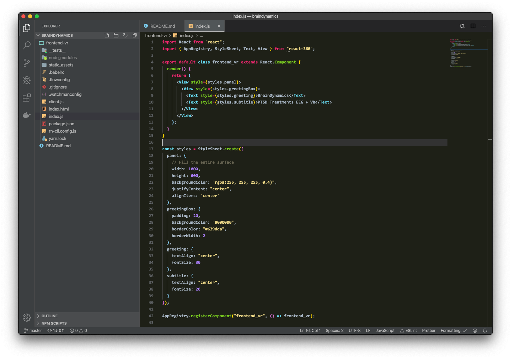

# WebStorm Monokai Theme for Visual Studio Code
Highlighted Monokai theme for VSCode with WebStorm workspace colors

Install here: https://marketplace.visualstudio.com/items?itemName=ctwhome.webstorm-monokai



## Edit the theme

Run f5 on vscode to open a debbuging instance of vscode withe the development theme.

To get infications on property names enable "Developer: Inspect TM Scopes" in vscode. 


## Publish into VSMarket Place

Install essentials
```
npm install -g vsce . 

vsce create-publisher (publisher name) 

```
Publish in to MarketPlace (add version: "major", "minor", or "patch")
```

vsce publish minor
```


